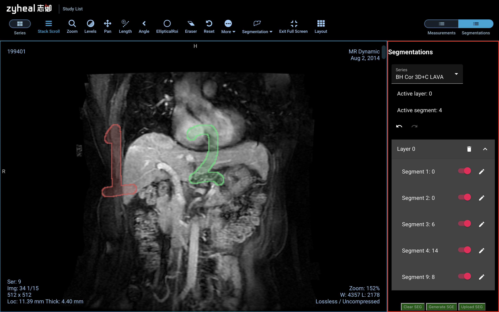

dcm & nii
======
数据标注工作在前端完成后, 标注的数据会被储存成`.dcm`的格式, 需要把dicom文件转换成
`.nii`的NIFTI文件方便模型训练特征提取以及可视化工作.

Development
-----------
本项目的是实现分割文件dicom和NIFTI的相互转换, 需要实现以下两个函数.

- [ ] dcmseg2nii
- [ ] nii2dcmseg

1. dcmseg2nii

`sample/dcmseg.dcm` 文件是前端生成的一个示例分割数据, 被标注的数据本身大小是`512*512*15`,
下图展示了第0张原始数据上的标注图像, 在图像右下角展示了标注数据情况, 比如`segment 4:14`
表示, 在第14层上有segment 4. 这些信息同样可以从`dcmseg.dcm`的元数据中得到.

现在需要实现`dcmseg2nii`函数, 该函数读入并解析`dcmseg.dcm`, 最终把dicom中的图像还原成`512*512*512`的矩阵.

2. nii2dcmseg
